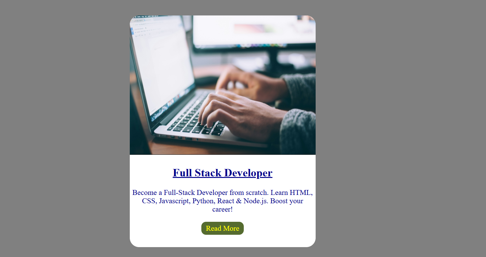

# Blog Post Card UI

A simple blog post card designed as a practice project while learning full-stack web development from freeCodeCamp.

## 📌 About the Project
This project focuses on creating a clean and responsive blog post card layout using basic front-end technologies.

## 🛠 Technologies Used
- HTML5
- CSS3

## 🎯 What I Learned
- Structuring content with semantic HTML
- Styling layouts using CSS
- Designing reusable UI components

## 📚 Learning Source
freeCodeCamp – Full Stack Development

## 👩‍💻 Author
Mehak

## 📸 Preview

